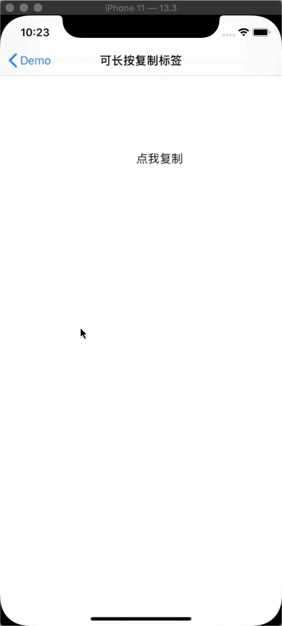
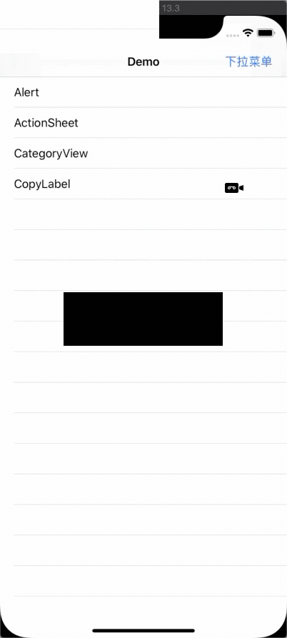
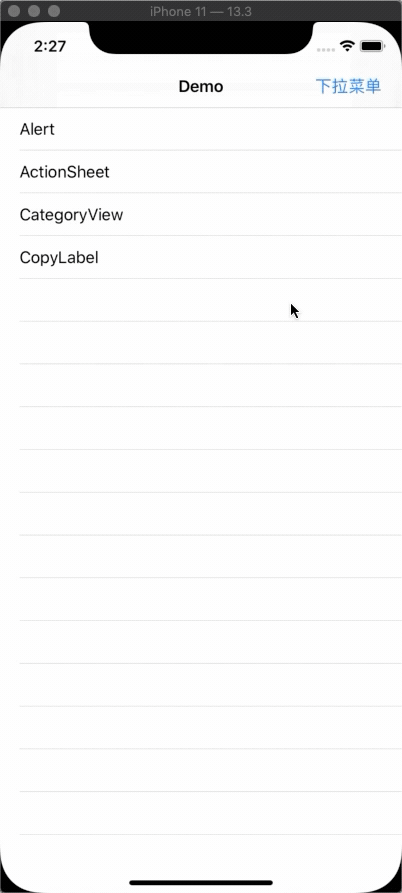

# XPYKit

[](https://travis-ci.org/xiangxiaopenyou/XPYKit)
[](https://cocoapods.org/pods/XPYKit)
[](https://cocoapods.org/pods/XPYKit)
[](https://cocoapods.org/pods/XPYKit)

## Example

To run the example project, clone the repo, and run `pod install` from the Example directory first.

## Requirements
iOS 8.0

## Installation

XPYKit is available through [CocoaPods](https://cocoapods.org). To install
it, simply add the following line to your Podfile:

```ruby
pod 'XPYKit' :git => 'https://github.com/xiangxiaopenyou/XPYKit.git
```

## Usage

1、Alert

    [XPYAlertManager showAlertWithTitle:@"Alert" message:@"Alert" cancel:@"取消" confirm:@"确定" inController:self confirmHandler:^{

        NSLog(@"alert confirm");
    
    } cancelHandler:^{

        NSLog(@"alert cancel");
    
    }];

2、ActionSheet

    [XPYAlertManager showActionSheetWithTitle:@"ActionSheet" message:@"ActionSheet" cancel:@"取消" inController:self actions:@[@"item0", @"item1", @"item2"] actionHandler:^(NSInteger index) {

        NSLog(@"click item%@", @(index));
    
    }];

3、CopyLabel

    XPYCopyLabel *label = [[XPYCopyLabel alloc] initWithFrame:CGRectMake(200, 200, 100, 50)];
    
    label.text = @"点我复制";
    
    [label sizeToFit];
    
    label.isCanCopy = YES;
    
    label.selelctedBackgroundColor = [UIColor grayColor];
    


4、CategoryView



5、DropdownView

    XPYDropdownConfigurations *config = [[XPYDropdownConfigurations alloc] init];
    // 背景颜色
    config.mainBackgroundColor = [UIColor colorWithWhite:0 alpha:0.2];
    // 下拉菜单颜色
    config.dropdownBackgroundColor = [UIColor blackColor];
    // 分割线颜色
    config.separatorColor = [UIColor whiteColor];
    // cell选中时颜色
    config.cellSelectedColor = [UIColor colorWithWhite:0 alpha:0.2];
    // 文字颜色
    config.titleColor = [UIColor whiteColor];
    // 下拉菜单宽度
    config.dropdownWidth = 130;
    // 箭头左下角在菜单视图的x坐标
    config.arrowOriginX = 100;
    // 隐藏箭头
    //config.arrowHeight = 0;

    XPYDropdownItemModel *model1 = [XPYDropdownItemModel makeModel:1 icon:[UIImage imageNamed:@"menu_write"] title:@"编辑" titleColor:nil];
    XPYDropdownItemModel *model2 = [XPYDropdownItemModel makeModel:2 icon:[UIImage imageNamed:@"menu_share"] title:@"分享" titleColor:nil];
    XPYDropdownItemModel *model3 = [XPYDropdownItemModel makeModel:3 icon:[UIImage imageNamed:@"menu_clear"] title:@"删除" titleColor:nil];
    
    CGFloat pointX = CGRectGetWidth(self.view.bounds) - 50.f;
    CGFloat pointY = [self isIphoneX] ? 88.f : 64.f;
    XPYDropdownView *dropdownView = [[XPYDropdownView alloc] initWithItemsArray:@[model1, model2, model3] configurations:config arrowPoint:CGPointMake(pointX, pointY)];
    //设置代理
    //dropdownView.delegate = self;
    [dropdownView show];




## Author

xiangxiaopenyou, xlpiOSer@163.com

## License

XPYKit is available under the MIT license. See the LICENSE file for more info.
